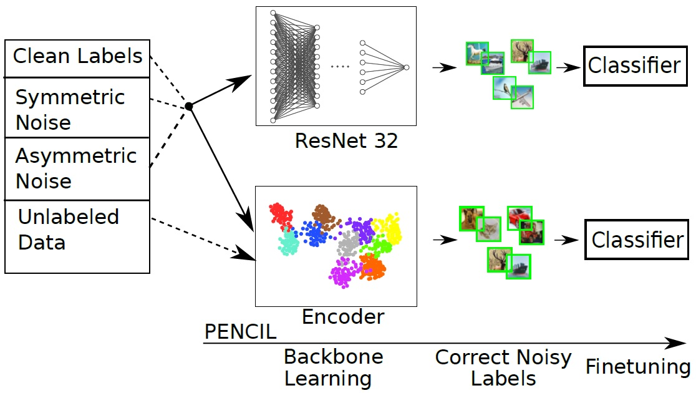
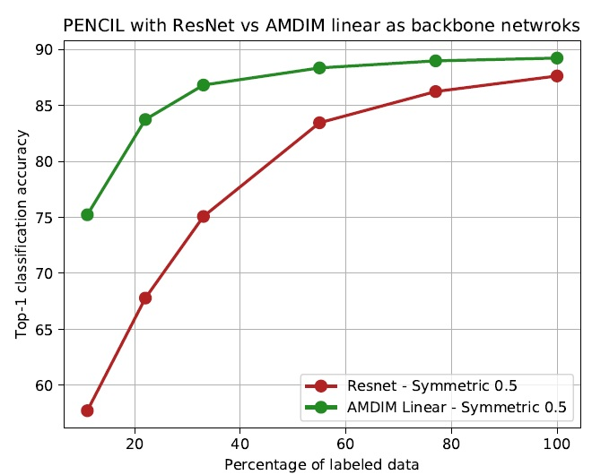

# Combining-PENCIL-with-AMDIM
Combining PENCIL with AMDIM for image classification with noisy and sparsely labeled data. This repository contains the implementation code for this paper: https://dl.acm.org/doi/10.1145/3411408.3411441

## Summary

  - [Description of the problem](#description-of-the-problem)
  - [Description of the repository](#description-of-the-repository)
  - [Requirements](#requirements)
  - [Usage](#usage)
  - [Experiments](#experiments)
  - [Results](#results)
  - [Citation](#citation)
  - [Acknowledgments](#acknowledgments)

## Description of the problem

In this paper we explore strategies for maintaining classification performance when the labels become noisy and sparse. In particular, we evaluate the effectiveness of combining PENCIL, a framework for correcting noisy labels during training and AMDIM, a self-supervised technique for learning good data representations from unlabeled data. We find that this combination is significantly more effective when dealing with sparse and noisy labels, compared to using either of these approaches alone.

In its original implementation, PENCIL uses ResNet-32 as the backbone network. On the other hand, AMDIM is capable of learning good representations for input data. It consists of an encoder that provides feature representations, which can then be used with an multi-layer perceptron (MLP) or a linear classifier to perform image classification. In the scenario of having sparse and noisy labels we propose to replace ResNet in PENCIL with AMDIM and a linear classifier as shown in the image below.



Since the encoder is trained without labels, it has already learned good representations for dataset and for this reason we choose to keep the weights of the encoder fixed. The intuition behind the choice of linear classifier instead of MLP, is that its lower capacity allows it to better generalize and avoid overfitting on the noisy labels.

## Description of the repository

```
    .
    ├── data                    # contains folders for each dataset separately
    │   └── cifar10
    ├── utils                   # help functions
    │   ├── cifar10_subset.py   # definition for Cifar10 dataset class
    |   └── mypreactresnet.py   # definition for preact ResNet32 model
    ├── 10000.npy               # 
    ├── 20000.npy               # 
    .
    .
    .
    ├── PENCIL.py               # 
    ├── check_distributions.py  # 
    ├── checkpoint.py           #  
    ├── clean.npy               # 
    ├── costs.py                # 
    ├── dokimi.npy              # 
    ├── info.txt                # 
    ├── make_distribution.py    # 
    ├── mixed_precision.py      # 
    ├── model.py                # 
    ├── task_classifiers.py     # 
    ├── test.py                 # 
    ├── train.py                # 
    └── utils_amdim.py          # 

```

## Requirements
    python = 3.7.4
    numpy = 1.17.3
    pytorch = 1.4.0
    torchvision = 0.5.0
    matplotlib = 3.1.1
    pillow=6.2.0
        
## Usage
Examples for running the method are :

     python PENCIL.py --noise clean --noise_rate 0.0 --lr 0.02 --alpha 0.1 --beta 0.8 --lambda1 200 --run-without-validation --classifiers
     
     python PENCIL.py --noise symmetric --noise_rate 0.1 --lr 0.02 --alpha 0.1 --beta 0.8 --lambda1 200 --run-without-validation --classifiers
     
     python PENCIL.py --noise asymmetric --noise_rate 0.3 --lr 0.03 --alpha 0.1 --beta 0.8 --lambda1 300 --run-without-validation --classifiers


## Experiments

For our experiments we used the CIFAR-10 data set. We dealed with symmetric and asymmetric noise and followed the procedure applied in original paper of PENCIL for introducing noise. Let the noise percentage of the labels is 𝑝 ∈ [0, 1]. In the case of symmetric noise, a label is changed to one of all the other 9 classes with probability 𝑝, while remains clean with probability 1−𝑝. As for the asymmetric noise, the changes in a class can be made according to the following correspondences: bird->plane, truck->car, deer -> horse and cat <-> dog. That is, labeling errors correspond to classes that have visual similarities. 

For our proposed method, we use the same settings with the implementation of the original PENCIL, but we change the backbone network to AMDIM with an encoder and a linear classifier. The encoder is trained on the CIFAR-10 training set (without the labels). We keep the same hyperparameters as the original papers, but reduce the number of epochs of the first stage of PENCIL to 5 from 70 (since AMDIM has already been trained with unlabeled images).

## Results
The following image illustrates accuracy versus the decreasing number of available data, for 50% symmetric, respectively with PENCIL with ResNet and AMDIM linear. 


The difference in performance with low number of samples is noticeable for the case of PENCIL with AMDIM linear.


    
## Citation
If you use this work you should cite this paper:

```
@inproceedings{10.1145/3411408.3411441,
  author = {Petropoulos, Alexandros and Diou, Christos},
  title = {Combining PENCIL with AMDIM for Image Classification with Noisy and Sparsely Labeled Data},
  year = {2020},
  isbn = {9781450388788},
  publisher = {Association for Computing Machinery},
  address = {New York, NY, USA},
  url = {https://doi.org/10.1145/3411408.3411441},
  doi = {10.1145/3411408.3411441},
  booktitle = {11th Hellenic Conference on Artificial Intelligence},
  pages = {93–96},
  numpages = {4},
  keywords = {deep learning, label noise, neural networks, self-learning},
  location = {Athens, Greece},
  series = {SETN 2020}
}
```

## Acknowledgments
https://github.com/yikun2019/PENCIL/blob/master/README.md

https://arxiv.org/abs/1903.07788

https://github.com/Philip-Bachman/amdim-public

https://arxiv.org/abs/1906.00910

    
